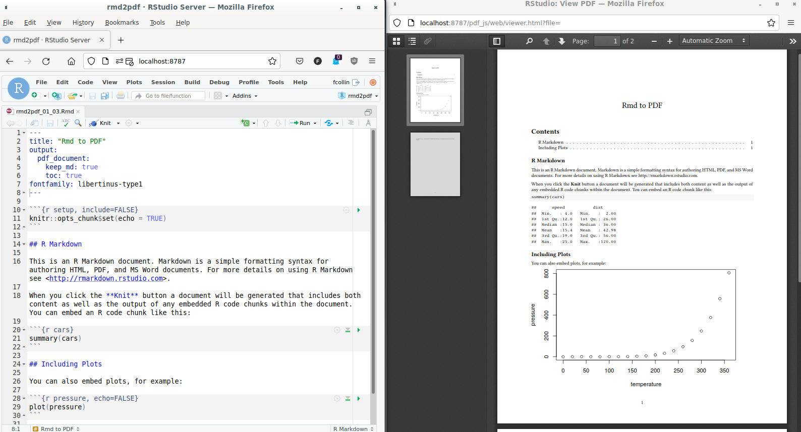

1 - Introduction
----------------

The RStudio environment includes templates of R Markdown documents which
propose as a configuration step to select a PDF output format. It is
then very easy to render the document, actually simple as a click.

 sequenceDiagram participant Rmd participant
pdf Rmd-&gt;&gt;pdf: knit button Rmd-&gt;&gt;pdf: =
`rmarkdown::pdf_document()` {{&lt; /mermaid &gt;}}

If starting is easy, the click (bait) is hidding complexity: the
question of PDF output configuration is already more challenging
(e.g. add a footnote, chance font):

-   under the hood, at least three different nested high-level tools are
    chained together to handle the R Markdown document (R, Pandoc and a
    LaTeX engine), fine tuning a PDF document in R consists in passing
    arguments to the right one using the application interface proposed
    by R.
-   two or three ways exist to convey the configuration code: either
    using a R function argument, or conveying settings via the yaml
    front matter of the R Markdown document, or eventually through a
    configuration file.

The aim of the present page is to provide an overview of the tools
involved in the pipeline when triggering the rendering of the PDF
document, and how to how to pass configuration elements to the right
underlying tool.

{} **How to start a PDF in RStudio:** (1) File &gt; New
File &gt; **RMarkdown** … &gt; Select output PDF and OK; (2) click the
**knit** button at the top of the source pane.  {}

Material and Methods
--------------------

The environment for the analysis was containerized, a docker image and
its definition was used to ensure that both the author and stakeholders
can either reproduce the analysis and / or extend the workflow Nüst et
al. (2020). The Docker definition was made publicly available at
<https://github.com/FCACollin/ayup_dock>, the version of the environment
used for a given report is provided at the top-right corner of each page
as `[ayup_doc:vx.x.x]`.

The report itself is also versioned, every release has its own version
number. For efficient and unambiguous communication, it is encouraged to
communicate the release version when raising comments and / or questions
as those may already be addressed in newer versions. The version number
is found at the top-left corner of every page following the title of the
document (`[RRMS/Covid 19 (vx.x.x)]`).

The examples below assumes a RStudio environment. If you encounter an
error of type: *it doesn’t work on my machine*, you can have a look at
the definition of the environment used to illustrate the present topic
as a docker image freely available at:
<https://github.com/FCACollin/ayup_dock>.

2 - Results
-----------

### 2.1 - R Markdown: `render()`/`pdf_document()`

Producing a pdf document from a R Markdown (rmd) input is managed by R,
but also involves [Pandoc](https://pandoc.org/): R takes care of the
conversion of the rmd file to a markdown file (md), and pandoc handles
the conversion toward a pdf document. The `rmarkdown`’s functions
`render()` and `pdf_document()` are high R level functions which can
manages most of the features a user my need when generating a document.

 sequenceDiagram participant Rmd participant
md participant pdf Rmd-&gt;&gt;md: R md-&gt;&gt;pdf: pandoc
Rmd-&gt;&gt;pdf: rmarkdown::pdf\_document() Note right of Rmd:
keep\_md=FALSE toc=TRUE {{&lt; /mermaid &gt;}}

For instance, the options can be used to keep the intermediary md file
and also influence the output by adding a table of content (TOC).

-   The options above can be passed via the `yaml` frontmatter (e.g.
    `rmd2pdf_01_03.Rmd`):

        ---
        title: "Rmd to PDF"
        output:
          pdf_document:
            keep_md: true
            toc: true
        ---

-   or via an output function.

        render(
          input = "rmd2pdf_01_02.Rmd",
          output_format = pdf_document(toc = TRUE, keep_md = TRUE)
        )

{} `render` and `pdf_document` are functions exported by
the `rmarkdown` package. Check [`?rmarkdown::pdf_document` ’s
help](https://rdrr.io/cran/rmarkdown/src/R/pdf_document.R). {}

### 2.2 - Pass arguments to Pandoc

Some options are handled by Pandoc. For Pandoc, configuration of an
output is handled by *[variables for
LaTeX](https://pandoc.org/MANUAL.html#variables-for-latex)* . In the
example above, the option TOC is conveyed to Pandoc directly. However,
not all the possibilities offered by Pandoc, found an exact matching
variable in R. This is when the `pandoc_args` argument from
`rmarkdown::pdf_document()` is used to feed Pandoc variables for LaTeX.

 sequenceDiagram participant Rmd participant
md participant pdf Rmd-&gt;&gt;+md: rmarkdown::pdf\_document() Note
right of Rmd: keep\_md=FALSE toc=TRUE md–&gt;&gt;-pdf: Pandoc Note
right of md: Variables For LaTeX fontfamily: libertinus-type1 {{&lt;
/mermaid &gt;}}

The Pandoc variables for LaTeX can be provisionned by:

-   the Rmarkdown document [yaml front
    matter](https://bookdown.org/yihui/rmarkdown-cookbook/latex-variables.html#latex-variables):

        ---
        title: "Rmd to PDF"
        output:
          pdf_document:
            keep_md: true
            toc: true
        fontfamily: libertinus-type1
        ---

-   the `pdf_document()` function:

<!-- -->

    rmarkdown::render(
      input = "rmd2pdf_01_03.Rmd",
      output_format = rmarkdown::pdf_document(
        toc = TRUE,
        pandoc_args = list(
          "--variable=fontfamily:libertinus-type1"
        )
      )
    )

### 2.3 - Pass arguments to the LaTeX engine

Pandoc itself is a high level programs which handles conversion between
formats. A conversion toward a PDF document requires an intermediary
LaTeX document later processed by a a LaTeX engine into pdf. Most of the
expected functionnalities are translated via Pandoc, however, sometimes,
LaTeX functionnalities are not covered and they must be conveyed from
the original R Markdown document to the LaTeX document.

 sequenceDiagram participant Rmd participant
md participant tex participant pdf Rmd-&gt;&gt;pdf:
rmarkdown::pdf\_document() Rmd-&gt;&gt;md: R Note right of Rmd:
rmarkdown arguments md-&gt;&gt;+tex: Pandoc Note right of md: LaTeX
Variables tex–&gt;&gt;-pdf: LaTeX engine Note right of tex: Extra
depencendies e.g. fancyhdr {{&lt; /mermaid &gt;}}

-   The yaml frontmatter won’t be self sufficient anymore, the use of
    `include/in_header` points at a supplementary `.tex` file:
    -   yaml:

    <!-- -->

        ---
        title: "Rmd to PDF"
        output:
          pdf_document:
            latex_engine: xelatex
            keep_md: true
            toc: true
            includes:
              in_header: "preamble.tex"
        mainfont: DejaVuSansMono
        ---

    -   `preambule.tex`:

    <!-- -->

        \usepackage{fancyhdr}
        \pagestyle{fancy}
        \fancyhead[L]{FCollin}

-   The use of `pdf_document()` is an interesting alternative, maybe
    more compact:

        rmarkdown::render(
          input = "rmd2pdf_01_04.Rmd",
          output_format = rmarkdown::pdf_document(
            toc = TRUE,
            latex_engine = "xelatex",
            pandoc_args = list("--variable=mainfont:DejaVuSansMono"),
            extra_dependencies = list(
              rmarkdown::latex_dependency(
                "fancyhdr",
                extra_lines = paste(
                  "\\pagestyle{fancy}",
                  "\\fancyhead[L]{FCollin}"
                )
              )
            )
          )
        )

Nüst, Daniel, Vanessa Sochat, Ben Marwick, Stephen J Eglen, Tim Head,
Tony Hirst, and Benjamin D Evans. 2020. “Ten Simple Rules for Writing
Dockerfiles for Reproducible Data Science.” Public Library of Science
San Francisco, CA USA. <https://doi.org/10.1371/journal.pcbi.1008316>.
