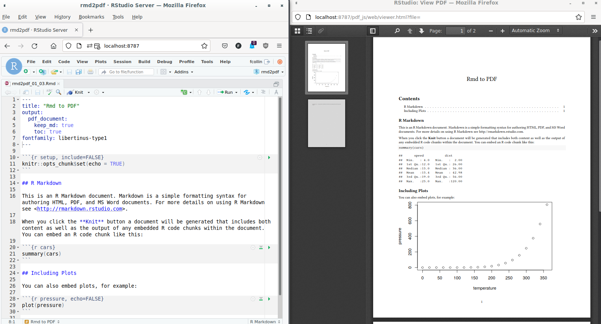
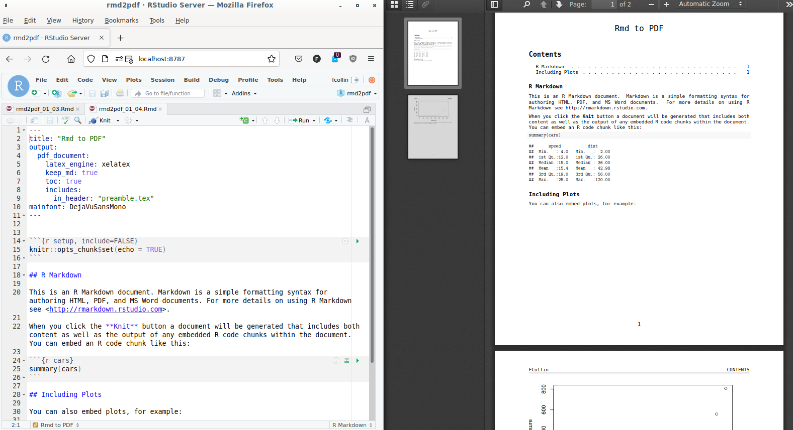

## 1 - Introduction

The RStudio environment includes templates of R Markdown documents which
propose as a configuration step to select a PDF output format. It is then
very easy to render the document, actually simple as a click.


sequenceDiagram
    participant Rmd
    participant pdf
    Rmd->>pdf: knit button
    Rmd->>pdf: = `rmarkdown::pdf_document()`



If starting is easy, the click (bait) is hidding complexity:
the question of PDF output configuration is already more challenging
(e.g. add a footnote, chance font):

- under the hood, at least three different nested high-level tools are chained
  together to handle the R Markdown
  document (R, Pandoc and a LaTeX engine), fine tuning a PDF document in
  R consists in passing arguments to the right one using the application
  interface proposed by R.
- two or three ways exist to convey the configuration code: either
  using a R function argument, or conveying settings via the yaml front matter
  of the R Markdown document, or eventually through a configuration file.

The aim of the present page is to provide an overview of the tools involved
in the pipeline when triggering the rendering of the PDF document, and how to
how to pass configuration elements to the right underlying tool.

{}
**How to start a PDF in RStudio:**
(1) File > New File > **RMarkdown** ... > Select output PDF and OK;
(2) click the  **knit** button at the top of the source pane.

{}


## 2. Material and Methods

A series of minimum working examples was generated to support the demonstration.
The examples were built at the same time as the results below were reported.

The environment for the examples was containerized, a docker image and
its definition was used to ensure reproducibility and / or enable the extenssion
of the work (Nüst et al. 2020).
The Docker definition was made publicly available at
<https://github.com/FCACollin/ayup_dock>.
Note that the image was not originally intended for this specific usage,
this explains why it also includes some R packages and LaTeX dependencies not
strictely necessary for the examples. However, the image as currently
defined was also configured for a research task where pdf reporting was a
requirement. Therefore, it was relevant to document the present examples based
on this image used in real-life work.

The image includes:

- A rocker/verse image (4.1.0)
- A series of additional R packaes.
- A series of LaTeX dependencies. 

In terms of pdf reporting, this image can:

- handles templates.
- use bibliographic references.


## 3 - Results

### 3.1 - R Markdown: `render()`/`pdf_document()`

Producing a pdf document from a R Markdown (rmd) input is managed by R, but also
involves [Pandoc](https://pandoc.org/): R takes care of the conversion
of the rmd file to a markdown file (md), and pandoc handles the conversion
toward a pdf document.
The `rmarkdown`'s functions `render()` and `pdf_document()` are high R
level functions which can manages most of the features a user my need when
generating a document.


sequenceDiagram
    participant Rmd
    participant md
    participant pdf
    Rmd->>md: R
    md->>pdf: pandoc
    Rmd->>pdf: rmarkdown::pdf_document()
    Note right of Rmd: keep_md=FALSE</br>toc=TRUE


For instance, the options can be used to keep the intermediary md file and
also influence the output by adding a table of content (TOC).

- The options above can be passed via the `yaml` frontmatter
  (e.g. `rmd2pdf_01_03.Rmd`):
  ```yaml
  ---
  title: "Rmd to PDF"
  output:
    pdf_document:
      keep_md: true
      toc: true
  ---
  ```

- or via an output function.
  ```r
  render(
    input = "rmd2pdf_01_02.Rmd",
    output_format = pdf_document(toc = TRUE, keep_md = TRUE)
  )
  ```

{}
`render` and `pdf_document` are functions exported by the `rmarkdown` package.
Check
[`?rmarkdown::pdf_document` 's help](
https://rdrr.io/cran/rmarkdown/src/R/pdf_document.R).
{}


### 3.2 - Pass arguments to Pandoc

Some options are handled by Pandoc. For Pandoc, configuration of an output is
handled by
 _[variables for LaTeX](https://pandoc.org/MANUAL.html#variables-for-latex)_ .
In the example above, the
option TOC is conveyed to Pandoc directly. However, not all the possibilities
offered by Pandoc, found an exact matching variable in R. 
This is when the `pandoc_args` argument from `rmarkdown::pdf_document()` is
used to feed Pandoc variables for LaTeX. 


sequenceDiagram
    participant Rmd
    participant md
    participant pdf
    Rmd->>+md: rmarkdown::pdf_document()
    Note right of Rmd: keep_md=FALSE</br>toc=TRUE
    md-->>-pdf: Pandoc
    Note right of md: Variables For LaTeX</br>fontfamily: libertinus-type1


The Pandoc variables for LaTeX can be provisionned by:

- the Rmarkdown document 
  [yaml front matter](
  https://bookdown.org/yihui/rmarkdown-cookbook/latex-variables.html#latex-variables
  ):
  ```yaml
  ---
  title: "Rmd to PDF"
  output:
    pdf_document:
      keep_md: true
      toc: true
  fontfamily: libertinus-type1
  ---
  ```
- the `pdf_document()` function:
```r
rmarkdown::render(
  input = "rmd2pdf_01_03.Rmd",
  output_format = rmarkdown::pdf_document(
    toc = TRUE,
    pandoc_args = list(
      "--variable=fontfamily:libertinus-type1"
    )
  )
)
```




### 3.3 - Pass arguments to the LaTeX engine

Pandoc itself is a high level programs which handles conversion between formats.
A conversion toward a PDF document requires an intermediary LaTeX document
later processed by a a LaTeX engine into pdf.
Most of the expected functionnalities are translated via Pandoc, however,
sometimes, LaTeX functionnalities are not covered and they must be conveyed
from the original R Markdown document to the LaTeX document.


sequenceDiagram
    participant Rmd
    participant md
    participant tex
    participant pdf
    Rmd->>pdf: rmarkdown::pdf_document()
    Rmd->>md: R
    Note right of Rmd: rmarkdown arguments
    md->>+tex: Pandoc
    Note right of md: LaTeX Variables
    tex-->>-pdf: LaTeX engine
    Note right of tex: Extra depencendies</br>e.g. fancyhdr


- The yaml frontmatter won't be self sufficient anymore, the use of 
`include/in_header` points at a supplementary `.tex` file:
    + yaml:
    ```yaml
    ---
    title: "Rmd to PDF"
    output:
      pdf_document:
        latex_engine: xelatex
        keep_md: true
        toc: true
        includes:
          in_header: "preamble.tex"
    mainfont: DejaVuSansMono
    ---
    ```
    + `preambule.tex`:
    ```tex
    \usepackage{fancyhdr}
    \pagestyle{fancy}
    \fancyhead[L]{FCollin}
    ```
- The use of `pdf_document()` is an interesting alternative, maybe more
  compact:
  ```r
  rmarkdown::render(
    input = "rmd2pdf_01_04.Rmd",
    output_format = rmarkdown::pdf_document(
      toc = TRUE,
      latex_engine = "xelatex",
      pandoc_args = list("--variable=mainfont:DejaVuSansMono"),
      extra_dependencies = list(
        rmarkdown::latex_dependency(
          "fancyhdr",
          extra_lines = paste(
            "\\pagestyle{fancy}",
            "\\fancyhead[L]{FCollin}"
          )
        )
      )
    )
  )
  ```



## 4. Discussion

It was evidenced that the original raw pdf has generated
by a simple click in RStudio, hides complexity. Entering the detail of this
complexity and decomposing the pipeline brings a better understanding of
the possible levels of configuration which can be addressed either through
the R functions, the Pandoc interface or the LaTeX engine. The configuration
of the output is also complex and may take advantage of a knowledge of the
Pandoc command line interface, a better understanding of the YAML format
for configuration, and a basic knowledge of LaTeX may also help in achieving
a very well designed report. This complexity allows an incredible flexibility
in the configuration of the reporting.

However, the complexity can also be seen as hurdle: the increase number
of programming languages decrease the likelyhood of finding contributors who
can leverage the whole potential of pdf reporting with R Markdown. To
aleviate this difficulty it is also possible to use templates: in other word,
the confirguration of a pdf output is a one-off, it is a deliverable itself
which can be injected in many reporting task (think about it as a corporate
Microsoft word template).

The pdf reporting as presented above, is an illustration of the mecanisms
involved to convert a R Markdown file into a document.
The same applies to render docx, html or other: the markdown file being at the
cross road and pandoc involved to the final conversion. As for the pdf
documents, all output can take advantage of templates, and markup languages
(e.g. LaTeX or html) accepts headers or other additional configuration files.

## References

Nüst, Daniel, Vanessa Sochat, Ben Marwick, Stephen J Eglen, Tim Head,
Tony Hirst, and Benjamin D Evans. 2020. “Ten Simple Rules for Writing
Dockerfiles for Reproducible Data Science.” Public Library of Science
San Francisco, CA USA. <https://doi.org/10.1371/journal.pcbi.1008316>.

